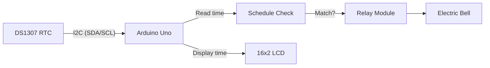
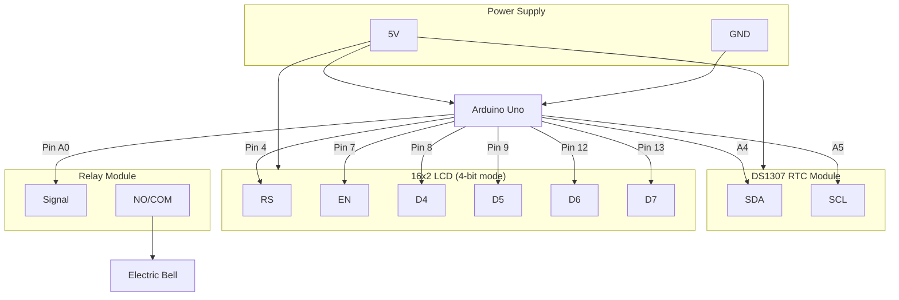

# ArduinoBell

**Automated school bell system powered by Arduino and a DS1307 real-time clock.**

Arduino C++ PlatformIO License GitHub Actions

Features • How It Works • Circuit Diagram • Bell Schedule • Quick Start • Configuration • Project Layout • Testing • Contributing • License

---

## Features

| Feature | Description |
| --- | --- |
| **Real-Time Clock** | DS1307 RTC keeps accurate time even during power loss (battery-backed) |
| **Configurable Schedule** | Bell times defined in a single header file -- add, remove, or change events without touching core logic |
| **LCD Display** | 16x2 character LCD shows current time and bell status in real time |
| **Relay-Driven Bell** | Controls an electric bell through a relay module -- works with any AC/DC bell |
| **Modular Codebase** | Clean separation: RTC driver, display logic, schedule config, and main loop in distinct files |
| **Automated Testing** | PlatformIO unit tests validate BCD conversion and schedule-matching logic on desktop |
| **CI Pipeline** | GitHub Actions verifies compilation and runs tests on every push |

---

## How It Works



1. **Read** -- The Arduino reads the current time from the DS1307 RTC over I2C every second.
2. **Check** -- The time is compared against the configurable bell schedule array.
3. **Ring** -- If the current time falls within a scheduled bell window, the relay pin goes HIGH and the bell rings.
4. **Display** -- The LCD shows the current time on line 1 and "BELL RINGING" status on line 2.

---

## Circuit Diagram



### Pin Mapping

| Arduino Pin | Connected To | Purpose |
| --- | --- | --- |
| A4 (SDA) | DS1307 SDA | I2C data line |
| A5 (SCL) | DS1307 SCL | I2C clock line |
| 4 | LCD RS | Register select |
| 7 | LCD EN | Enable |
| 8 | LCD D4 | Data bit 4 |
| 9 | LCD D5 | Data bit 5 |
| 12 | LCD D6 | Data bit 6 |
| 13 | LCD D7 | Data bit 7 |
| A0 (14) | Relay IN | Bell relay control signal |
| 5V | RTC VCC, LCD VCC | Power supply |
| GND | RTC GND, LCD GND, Relay GND | Common ground |

### Components

| Part | Quantity | Notes |
| --- | --- | --- |
| Arduino Uno (or compatible) | 1 | ATmega328P microcontroller |
| DS1307 RTC Module | 1 | With CR2032 battery for backup |
| 16x2 LCD Display | 1 | HD44780-compatible, 4-bit mode |
| 5V Relay Module | 1 | Single-channel, active HIGH |
| Electric Bell | 1 | AC or DC, connected through relay |
| 10K Potentiometer | 1 | LCD contrast adjustment |
| Jumper Wires | ~20 | Male-to-male and male-to-female |
| Breadboard | 1 | For prototyping (optional for final install) |

> See [docs/circuit_diagram.md](docs/circuit_diagram.md) for a detailed wiring guide.

---

## Bell Schedule

The default schedule is defined in [`include/bell_schedule.h`](include/bell_schedule.h):

| Time | Duration | Event |
| --- | --- | --- |
| 08:10 | 40 sec | Morning assembly |
| 08:30 | 20 sec | Period 1 start |
| 09:30 | 20 sec | Period 2 start |
| 10:30 | 20 sec | Period 3 start |
| 11:30 | 20 sec | Period 4 start |
| 12:10 | 20 sec | Lunch break |
| 13:10 | 20 sec | Period 5 start |
| 14:10 | 20 sec | Period 6 start |
| 14:30 | 20 sec | Short break |
| 15:30 | 20 sec | Period 7 start |
| 16:30 | 20 sec | Dismissal |

---

## Quick Start

### Prerequisites

- [PlatformIO CLI](https://docs.platformio.org/en/latest/core/installation.html) or [Arduino IDE 2.x](https://www.arduino.cc/en/software)
- Arduino Uno (or compatible board)
- DS1307 RTC module, 16x2 LCD, relay module, electric bell

### Option 1: PlatformIO (recommended)

```bash
git clone https://github.com/hariharanragothaman/arduinobell.git
cd arduinobell
pio run                    # compile
pio run --target upload    # upload to connected Arduino
pio device monitor         # open serial monitor (9600 baud)
```

### Option 2: Arduino IDE

1. Open `src/main.cpp` in the Arduino IDE.
2. Copy the `include/*.h` files into the sketch folder (or add them to the IDE's library path).
3. Select **Board: Arduino Uno** and the correct **Port**.
4. Click **Upload**.

### Setting the RTC

The DS1307 retains time via its backup battery. To set the initial time, uncomment and edit the `rtcSetDateTime()` call in `setup()` of `src/main.cpp`, upload once, then comment it back out and re-upload so the time is not reset on every power cycle.

---

## Configuration

All configuration lives in header files under `include/`:

| File | What to Edit | Description |
| --- | --- | --- |
| `bell_schedule.h` | `BELL_SCHEDULE[]` array | Add/remove/modify bell times (24h format) and durations |
| `display.h` | `LCD_*` pin constants | Change LCD wiring pin assignments |
| `rtc.h` | `DS1307_I2C_ADDRESS` | Change RTC I2C address (rarely needed) |
| `src/main.cpp` | `BELL_PIN` | Change the relay control pin |

### Adding a Bell Event

Edit `include/bell_schedule.h` and add an entry to the `BELL_SCHEDULE` array:

```cpp
static const BellEvent BELL_SCHEDULE[] = {
  // ...existing entries...
  {17, 0, 30},  // 5:00 PM -- evening bell, 30 seconds
};
```

---

## Project Layout

```
arduinobell/
├── src/
│   └── main.cpp              # Main Arduino sketch
├── include/
│   ├── bell_schedule.h       # Configurable bell schedule + matching logic
│   ├── rtc.h                 # DS1307 RTC driver (I2C read/write, BCD conversion)
│   └── display.h             # 16x2 LCD display helpers
├── test/
│   ├── test_bcd/
│   │   └── test_bcd.cpp      # Unit tests for BCD conversion functions
│   └── test_schedule/
│       └── test_schedule.cpp # Unit tests for schedule matching logic
├── docs/
│   └── circuit_diagram.md    # Detailed wiring guide and component list
├── .github/
│   └── workflows/
│       └── ci.yml            # CI: compile check + unit tests
├── platformio.ini            # PlatformIO project configuration
├── .gitignore                # Arduino/PlatformIO ignores
├── LICENSE                   # MIT license
└── README.md
```

---

## Testing

Tests run on the desktop (no hardware required) using PlatformIO's native environment:

```bash
pio test -e native
```

| Suite | What's Tested |
| --- | --- |
| `test_bcd` | `decToBcd()` and `bcdToDec()` conversion for known values, round-trips, edge cases |
| `test_schedule` | `shouldRingBell()` for each scheduled time, off-schedule times, boundary conditions |

Tests also run automatically on every push via GitHub Actions.

---

## Contributing

1. Fork the repo.
2. Create a feature branch (`git checkout -b feature/my-feature`).
3. Run tests (`pio test -e native`).
4. Open a PR.

---

## License

MIT -- Hariharan Ragothaman
