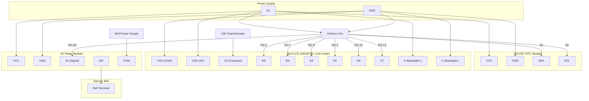

# Circuit Diagram

Detailed wiring guide for the ArduinoBell system.

---

## System Overview

---

## Pin Mapping

| Arduino Pin | Connected To | Purpose |
| --- | --- | --- |
| A4 (SDA) | DS1307 SDA | I2C data line for real-time clock |
| A5 (SCL) | DS1307 SCL | I2C clock line for real-time clock |
| 4 | LCD RS | LCD register select |
| 7 | LCD EN | LCD enable signal |
| 8 | LCD D4 | LCD data bit 4 |
| 9 | LCD D5 | LCD data bit 5 |
| 12 | LCD D6 | LCD data bit 6 |
| 13 | LCD D7 | LCD data bit 7 |
| A0 (14) | Relay IN | Bell relay control signal (active HIGH) |
| 5V | RTC VCC, LCD VDD, LCD A, Relay VCC | Power supply to modules |
| GND | RTC GND, LCD VSS, LCD K, Relay GND | Common ground |

---

## Component List

| Part | Quantity | Specifications |
| --- | --- | --- |
| Arduino Uno | 1 | ATmega328P, 5V logic, USB-B |
| DS1307 RTC Module | 1 | I2C interface, CR2032 battery backup, 0x68 address |
| 16x2 LCD Display | 1 | HD44780-compatible, 4-bit mode, 5V |
| 10K Potentiometer | 1 | Connected to LCD VO pin for contrast adjustment |
| 5V Relay Module | 1 | Single-channel, active HIGH, optocoupler isolated |
| Electric Bell | 1 | AC or DC, rated for your institution's voltage |
| CR2032 Battery | 1 | For DS1307 RTC backup (usually included with module) |
| Breadboard | 1 | For prototyping; replace with PCB for permanent install |
| Jumper Wires | ~20 | Male-to-male and male-to-female |
| USB Cable (Type B) | 1 | For programming and powering Arduino |

---

## Wiring Instructions

### 1. DS1307 RTC Module

The RTC communicates over I2C. Connect:

- **SDA** to Arduino **A4**
- **SCL** to Arduino **A5**
- **VCC** to Arduino **5V**
- **GND** to Arduino **GND**

The module includes pull-up resistors on the I2C lines. No external pull-ups are needed.

### 2. 16x2 LCD Display (4-bit mode)

The LCD uses 6 data/control lines:

| LCD Pin | Name | Arduino Pin | Notes |
| --- | --- | --- | --- |
| 1 | VSS | GND | Ground |
| 2 | VDD | 5V | Power |
| 3 | VO | Potentiometer wiper | Contrast (connect pot ends to 5V and GND) |
| 4 | RS | Pin 4 | Register select |
| 5 | RW | GND | Write mode (tie to ground) |
| 6 | EN | Pin 7 | Enable |
| 11 | D4 | Pin 8 | Data |
| 12 | D5 | Pin 9 | Data |
| 13 | D6 | Pin 12 | Data |
| 14 | D7 | Pin 13 | Data |
| 15 | A | 5V (via 220 ohm resistor) | Backlight anode |
| 16 | K | GND | Backlight cathode |

Pins 7-10 (D0-D3) are left unconnected in 4-bit mode.

### 3. Relay Module

- **IN** to Arduino **A0** (pin 14)
- **VCC** to Arduino **5V**
- **GND** to Arduino **GND**
- Wire the electric bell through the relay's **COM** (common) and **NO** (normally open) terminals
- Connect one wire of the bell's power supply to **COM** and the bell terminal to **NO**

When the Arduino drives A0 HIGH, the relay closes and the bell rings.

---

## Safety Notes

- The relay isolates the Arduino's low-voltage circuit from the bell's power supply. Never connect mains voltage directly to the Arduino.
- If using an AC bell, ensure the relay is rated for the voltage and current. A standard 5V relay module is typically rated for 10A at 250VAC.
- For a permanent installation, solder connections onto a prototyping PCB and mount the system in an enclosure.
- Ensure the DS1307 battery is installed so the clock retains time during power outages.
